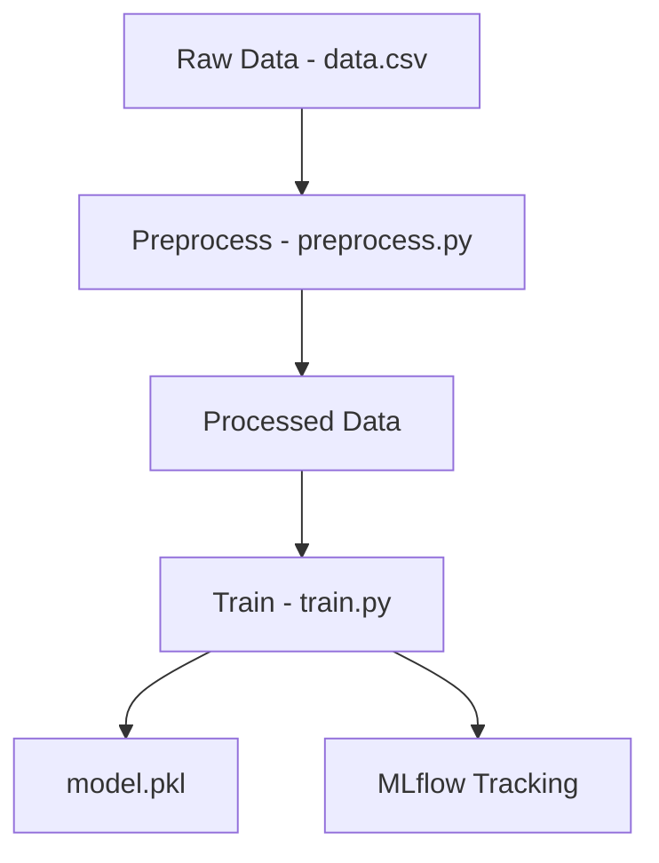
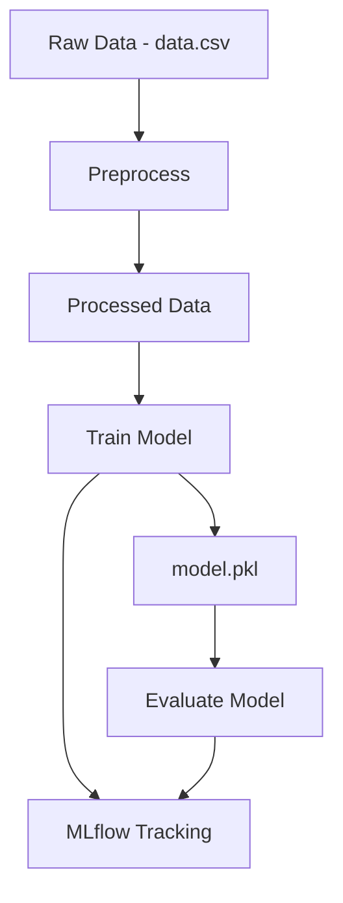
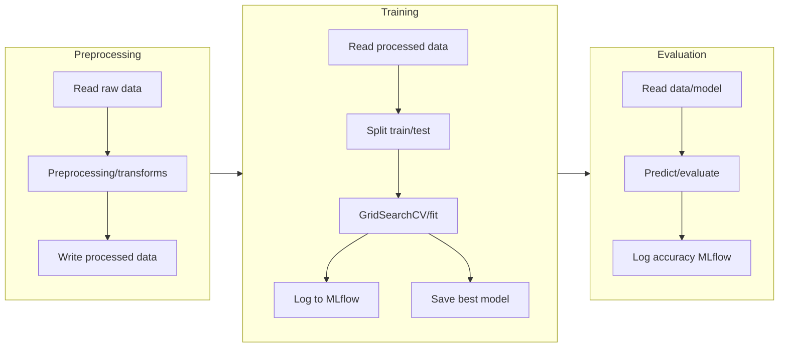
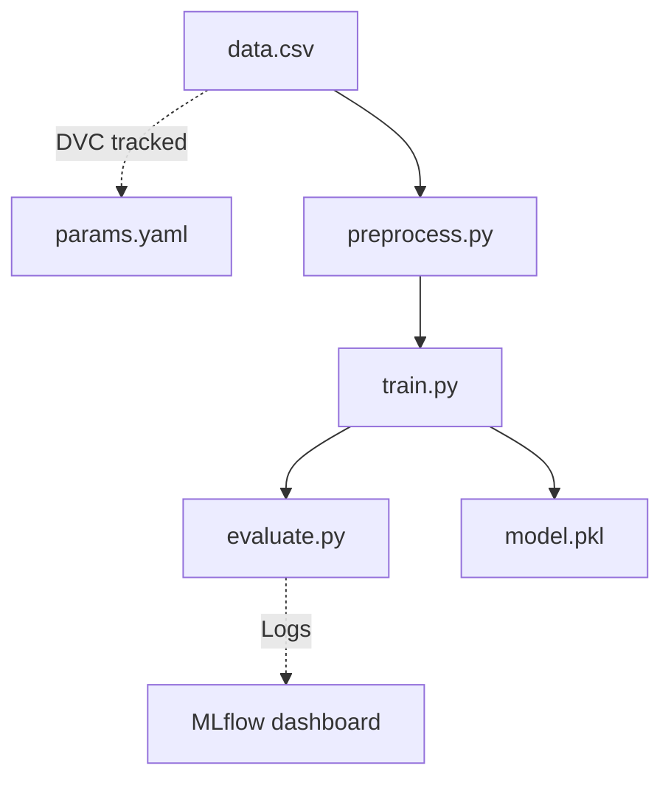

# Project Documentation: Machine Learning Pipeline with DVC & MLflow

This repository implements a robust, reproducible, and collaborative machine learning pipeline using **DVC**, **MLflow**, and **scikit-learn**, focused on the Pima Indians Diabetes Dataset. Below you’ll find an in-depth explanation of each file and how they contribute to the end-to-end workflow.

---

## requirements.txt

This file lists all Python dependencies required for the project.

| Package      | Purpose                                             |
|--------------|----------------------------------------------------|
| dvc          | Data & pipeline version control                     |
| dagshub      | Integration with DagsHub for storage/MLflow         |
| scikit-learn | ML algorithms (Random Forests, metrics, etc.)       |
| mlflow       | Experiment tracking                                 |
| dvc-s3       | DVC support for S3 remote storage                   |

```txt
dvc dagshub scikit-learn mlflow dvc-s3
```

**Best Practice:**  
Install with `pip install -r requirements.txt` to ensure the environment matches the pipeline.

---

## data.csv

This is the raw data file, containing rows of comma-separated values representing features and labels for diabetes prediction.

- **Columns (as seen in header):**
    - Pregnancies, Glucose, BloodPressure, SkinThickness, Insulin, BMI, DiabetesPedigreeFunction, Age, Outcome

**Sample:**
```csv
Pregnancies,Glucose,BloodPressure,SkinThickness,Insulin,BMI,DiabetesPedigreeFunction,Age,Outcome
4,148,72,35,0,28.0,0.627,50,1
1,85,66,29,0,26.6,0.351,31,0
...
```

**Usage:**  
- Used as the base dataset for all pipeline stages.
- Tracked by DVC for reproducibility.

---

## data.csv.dvc

A DVC-tracked metafile for `data.csv`. It records the checksum/hash and storage info for the dataset, enabling version control.

**Key Fields:**
- `md5`: Content hash for change tracking
- `size`: File size in bytes
- `path`: Relative path to the data file

```yaml
outs:
  - md5: 739f3c9177b13d1c15aa060046cfb023
    size: 23872
    hash: md5
    path: data.csv
```

**Purpose:**  
Tracks the dataset in DVC, so changes are versioned and reproducible.

---

## dvc.yaml

Defines the DVC pipeline stages and their dependencies/outputs. Each pipeline stage is a reproducible step in your ML workflow.

**Key Stages:**

| Stage      | Command                    | Deps                      | Outs/Params                  |
|------------|---------------------------|---------------------------|------------------------------|
| preprocess | `python src/preprocess.py` | data/raw/data.csv, script | data/processed/data.csv, params |
| train      | `python src/train.py`      | data/raw/data.csv, script | models/model.pkl, params     |
| evaluate   | `python src/evaluate.py`   | data/raw/data.csv, model, script | -                 |

```yaml
stages:
  preprocess:
    cmd: python src/preprocess.py
    deps:
      - data/raw/data.csv
      - src/preprocess.py
    params:
      - preprocess.input
      - preprocess.output
    outs:
      - data/processed/data.csv
  train:
    cmd: python src/train.py
    deps:
      - data/raw/data.csv
      - src/train.py
    params:
      - train.data
      - train.max_depth
      - train.model
      - train.n_estimators
      - train.random_state
    outs:
      - models/model.pkl
  evaluate:
    cmd: python src/evaluate.py
    deps:
      - data/raw/data.csv
      - models/model.pkl
      - src/evaluate.py
```

**Purpose:**  
Defines automated, reproducible steps—from data cleaning to model evaluation.

---

## dvc.lock

A DVC-generated file that captures the exact state (hashes/params) of all files and parameters at the time the pipeline was last run.

**Highlights:**
- Stores the precise versions of data/scripts/params used for each stage
- Guarantees pipeline reproducibility

**Example:**  
```yaml
stages:
  preprocess:
    deps:
      ...
    outs:
      ...
  train:
    ...
  evaluate:
    ...
```

**Purpose:**  
Enables exact recreation of past results and ensures pipeline integrity.

---

## README.md

### Project: Data Pipeline with DVC and MLflow for Machine Learning

A comprehensive introduction and quickstart for the project, including:
- Rationale for using DVC & MLflow
- Explanation of each pipeline stage (preprocess, train, evaluate)
- Technology stack and best practices
- Example DVC commands for adding new stages

**Excerpt:**
```markdown
Key Features of the Project:
- Data Version Control (DVC)
- Experiment Tracking with MLflow
- Pipeline Stages: Preprocessing, Training, Evaluation
```

**Purpose:**  
Onboarding documentation for users, contributors, and reviewers.

---

## params.yaml

Centralized configuration for all pipeline parameters, ensuring parameter management and versioning.

**Structure:**
```yaml
preprocess:
  input: data/raw/data.csv
  output: data/processed/data.csv
train:
  data: data/raw/data.csv
  model: models/model.pkl
  random_state: 42
  n_estimators: 100
  max_depth: 5
```

**Purpose:**  
- Enables hyperparameter tuning and pipeline re-runs with new settings
- Tracked by DVC to ensure full reproducibility

---

## preprocess.py

### Overview

Performs data preprocessing by reading the raw CSV file, optionally transforming it, and saving the processed data as specified in `params.yaml`.

**Key Features:**
- Reads parameters from `params.yaml`
- Loads raw data
- Writes processed data to output path (with no header, index=False)

**Code Outline:**
```python
import pandas as pd
import yaml
import os

params = yaml.safe_load(open("params.yaml"))['preprocess']

def preprocess(input_path, output_path):
    data = pd.read_csv(input_path)
    os.makedirs(os.path.dirname(output_path), exist_ok=True)
    data.to_csv(output_path, header=None, index=False)
    print(f"Preprocesses data saved to {output_path}")

if __name__=="__main__":
    preprocess(params["input"], params["output"])
```

**Purpose:**  
- Standardizes data format for downstream ML stages
- Ensures data is consistent and ready for modeling

---

## train.py

### Overview

Trains a Random Forest Classifier using the preprocessed data and tracks the entire experiment with MLflow.

**Notable Features:**
- Loads data and parameters from `params.yaml`
- Splits data into train/test
- Hyperparameter tuning with GridSearchCV
- Logs accuracy, confusion matrix, classification report, and parameters to MLflow
- Saves the best model as a pickle file

**Code Outline:**
```python
import pandas as pd
from sklearn.ensemble import RandomForestClassifier
import pickle
import yaml
from sklearn.metrics import accuracy_score, confusion_matrix, classification_report
from mlflow.models import infer_signature
import os
from sklearn.model_selection import train_test_split, GridSearchCV
import mlflow

# Load params
params = yaml.safe_load(open("params.yaml"))["train"]

def train(data_path, model_path, random_state, n_estimators, max_depth):
    # Load data, split, etc.
    ...
    # Hyperparameter tuning
    ...
    # Train, log, save
    ...

if __name__ == "__main__":
    train(params['data'], params['model'], params['random_state'], params['n_estimators'], params['max_depth'])
```

#### Data and Model Flow



**Purpose:**  
- Delivers a best-fit ML model
- Provides comprehensive experiment tracking (hyperparameters, metrics, artifacts)
- Ensures model reproducibility and auditability

---

## evaluate.py

### Overview

Evaluates the saved machine learning model, logs accuracy to MLflow, and prints the performance.

**Key Features:**
- Loads evaluation params from `params.yaml`
- Reads the data and model
- Computes accuracy
- Logs metric to MLflow

**Code Outline:**
```python
import pandas as pd
import pickle
from sklearn.metrics import accuracy_score
import yaml
import mlflow
import os

params = yaml.safe_load(open("params.yaml"))["train"]

def evaluate(data_path, model_path):
    data = pd.read_csv(data_path)
    ...
    mlflow.log_metric("accuracy", accuracy)
    print("Model accuracy:{accuracy}")

if __name__=="__main__":
    evaluate(params["data"], params["model"])
```

**Purpose:**  
- Provides feedback on model quality
- Ensures model performance metrics are logged and shareable

---

## model.pkl

A binary file containing the serialized (pickled) trained Random Forest model.

- Created by `train.py`
- Used by `evaluate.py` for predictions

**Purpose:**  
- Persistence of the best trained model for deployment, evaluation, or reproducibility

---

## python-package.yml

### Overview

GitHub Actions workflow for continuous integration of the Python package.

**Key Steps:**
1. **Checkout & Setup:** Checks out code, sets up Python (3.9, 3.10, 3.11).
2. **Install:** Upgrades pip, installs linter/test tools and dependencies.
3. **Lint:** Runs flake8 checks for code quality.
4. **Test:** Runs pytest to ensure correctness.

**Code Outline:**
```yaml
jobs:
  build:
    runs-on: ubuntu-latest
    strategy:
      matrix:
        python-version: ["3.9", "3.10", "3.11"]
    steps:
      - uses: actions/checkout@v4
      - name: Set up Python ${{ matrix.python-version }}
        ...
      - name: Install dependencies
        ...
      - name: Lint with flake8
        ...
      - name: Test with pytest
        ...
```

**Purpose:**  
- Ensures code remains bug-free and style-compliant
- Provides automatic test validation on every push/PR

---

## __init__.py

An empty file marking the directory as a Python package.

**Purpose:**  
- Required for module imports and structuring code as a package

---

## model.pkl

A binary file created by `train.py` that contains the trained Random Forest Classifier.

**Purpose:**  
- Used for prediction in the evaluation stage and potential deployment

---

---

## Pipeline Data Flow



---

## Pipeline Stage Logic



---

## Data, Model, and Experiment Versioning

- **DVC**: Ensures all data/model/artifact changes are tracked
- **params.yaml**: Centralizes all runtime/configuration settings
- **MLflow**: Logs all model metrics, artifacts, and hyperparameters in a reproducible, shareable dashboard

---

## Code and Data Lineage



---

## Key Project Takeaways

```card
{
    "title": "Reproducible ML Pipeline",
    "content": "All data, parameters, scripts, and models are version-controlled for maximum reliability and collaboration."
}
```

```card
{
    "title": "MLflow Experiment Tracking",
    "content": "All metrics, models, and params are tracked and visualized for easy comparison and governance."
}
```

---

## How to Add New DVC Stages

```bash
dvc stage add -n preprocess \
  -p preprocess.input,preprocess.output \
  -d src/preprocess.py -d data/raw/data.csv \
  -o data/processed/data.csv \
  python src/preprocess.py

dvc stage add -n train \
  -p train.data,train.model,train.random_state,train.n_estimators,train.max_depth \
  -d src/train.py -d data/raw/data.csv \
  -o models/model.pkl \
  python src/train.py

dvc stage add -n evaluate \
  -d src/evaluate.py -d models/model.pkl -d data/raw/data.csv \
  python src/evaluate.py
```

---

## Summary Table

| File                  | Purpose                                                   |
|-----------------------|-----------------------------------------------------------|
| requirements.txt      | Python dependencies                                       |
| data.csv              | Raw dataset                                               |
| data.csv.dvc          | DVC tracking metafile                                     |
| dvc.yaml              | Pipeline stage definitions                                |
| dvc.lock              | Versioned state of data/code/params for pipeline          |
| README.md             | Project introduction and usage                            |
| params.yaml           | Central config for all pipeline parameters                |
| preprocess.py         | Data preprocessing script                                 |
| train.py              | Model training/MLflow logging                             |
| evaluate.py           | Model evaluation/MLflow metric logging                    |
| python-package.yml    | GitHub Actions CI workflow                                |
| __init__.py           | Declares Python package                                   |
| model.pkl             | Trained model artifact                                    |

---

## ℹ️ Final Notes

- **DVC** + **MLflow** + **CI** = fully reproducible, collaborative, auditable ML workflow.
- All code/data/model changes are versioned and traceable.
- Onboard new team members with confidence—every step is documented, tracked, and automated.

---

## ❤️ Contributions

Feel free to fork, adapt, and contribute to this pipeline for your own projects or research!